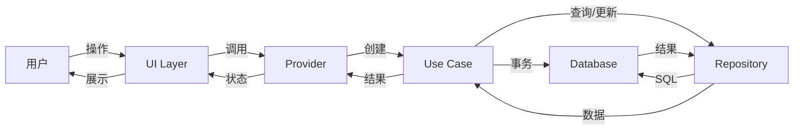
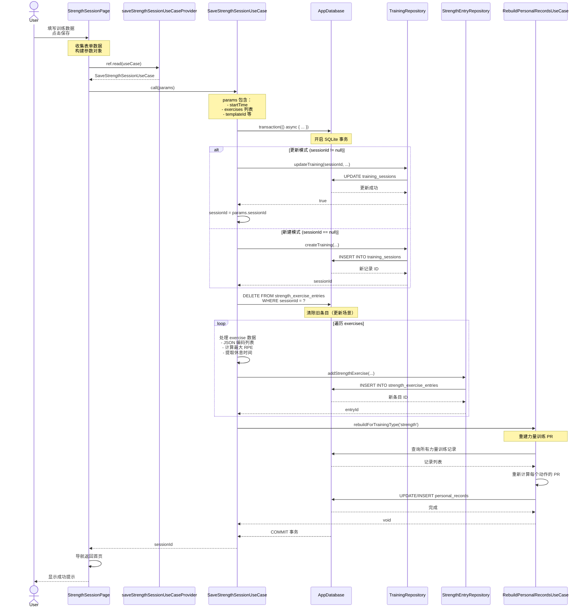
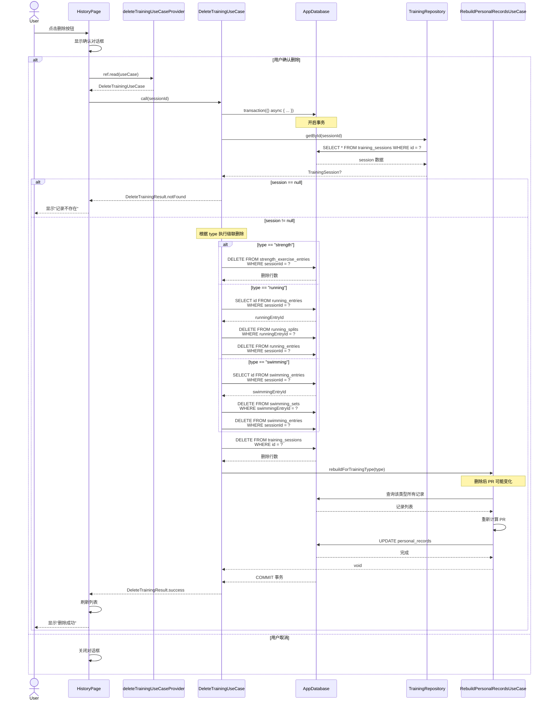
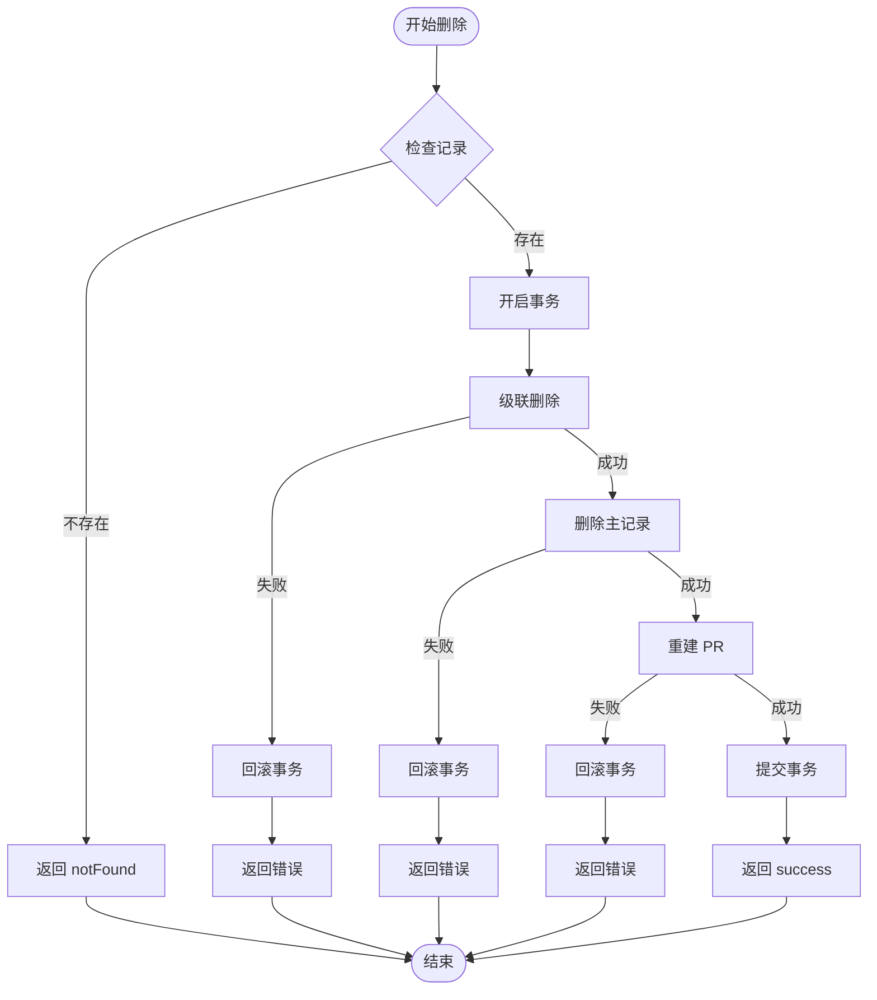
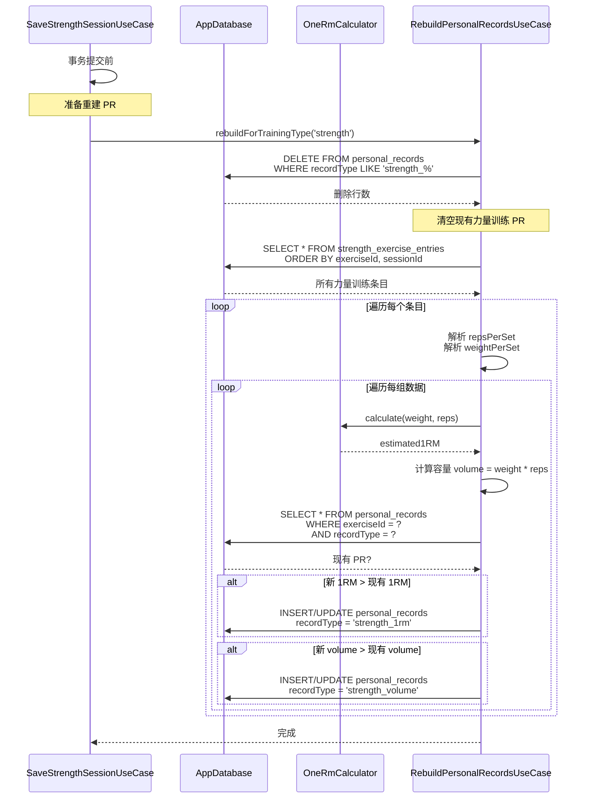
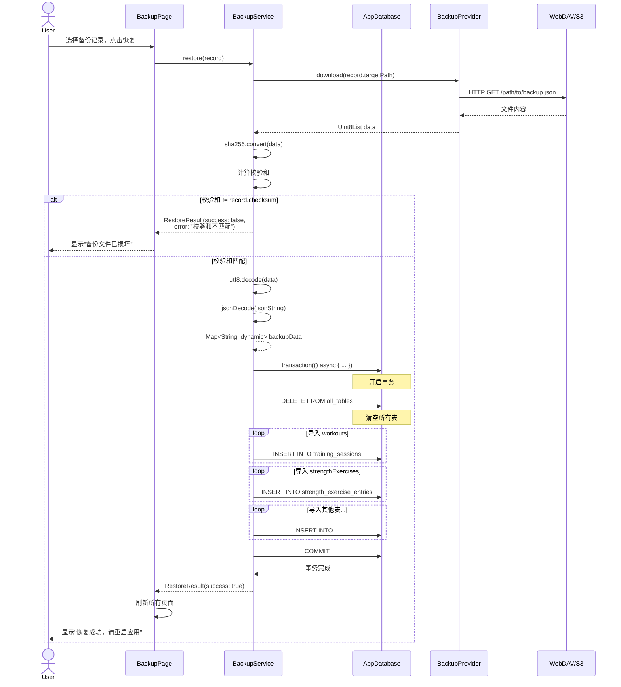
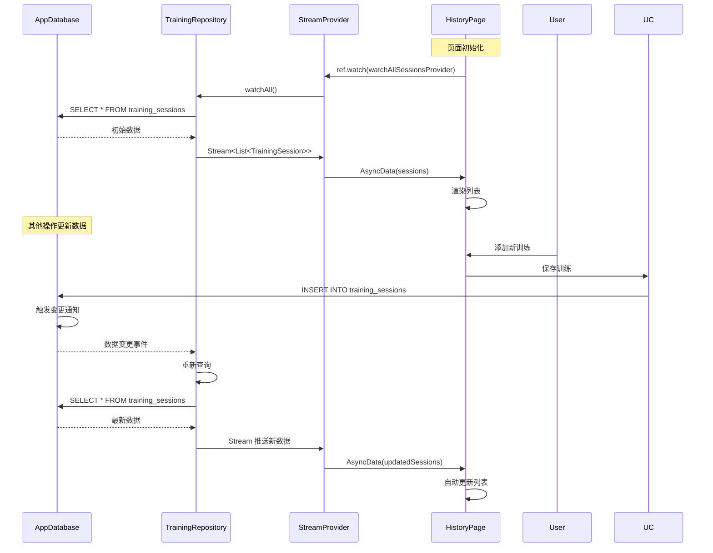
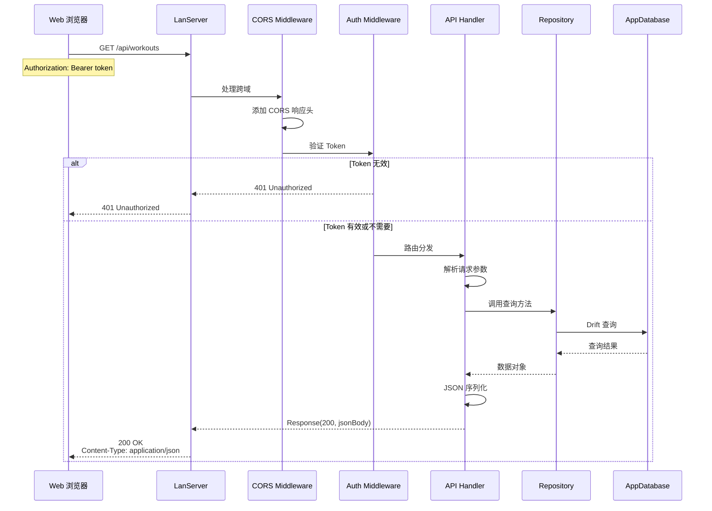
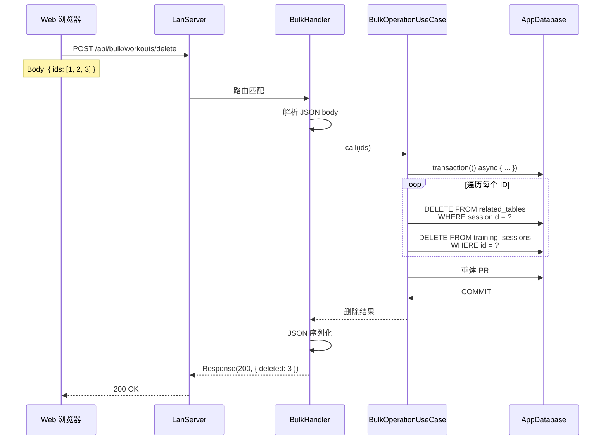

# FitTrack 数据流文档

> 本文档详细描述 FitTrack 各个核心场景的数据流动过程。
>
> **版本**: 1.0.0
> **最后更新**: 2026-03-25

---

## 目录

1. [数据流概述](#1-数据流概述)
2. [训练记录保存](#2-训练记录保存)
3. [训练记录删除](#3-训练记录删除)
4. [PR 检测与更新](#4-pr-检测与更新)
5. [备份与恢复](#5-备份与恢复)
6. [响应式数据更新](#6-响应式数据更新)
7. [LAN API 数据流](#7-lan-api-数据流)

---

## 1. 数据流概述

### 1.1 标准数据流模型



### 1.2 数据流原则

1. **单向数据流**：数据从 UI 流向数据库，结果流回 UI
2. **事务边界**：多步操作在事务中执行，保证原子性
3. **响应式更新**：Stream 自动推送数据变更
4. **错误传播**：错误逐层返回，UI 统一处理

---

## 2. 训练记录保存

### 2.1 力量训练保存流程



### 2.2 数据转换细节

#### 输入数据（UI）

```dart
// 用户填写的表单数据
StrengthExerciseInput {
  exerciseId: 1,
  exerciseName: "卧推",
  defaultReps: 10,
  defaultWeight: 60.0,
  repsPerSet: [10, 8, 6],
  weightPerSet: [60.0, 65.0, 70.0],
  completedSets: [true, true, true],
  rpeValues: [8, 9, 10],
  restSecondsValues: [90, 120, null],
}
```

#### 存储数据（Database）

```dart
// 转换后的数据库存储
StrengthExerciseEntriesCompanion {
  sessionId: Value(123),
  exerciseId: Value(1),
  exerciseName: Value("卧推"),
  sets: Value(3),
  defaultReps: Value(10),
  defaultWeight: Value(60.0),
  repsPerSet: Value("[10, 8, 6]"),      // JSON 编码
  weightPerSet: Value("[60.0, 65.0, 70.0]"),  // JSON 编码
  setCompleted: Value("[true, true, true]"),
  rpe: Value(10),                        // 最大值
  restSeconds: Value(90),                // 第一个非 null 值
  sortOrder: Value(0),
}
```

---

## 3. 训练记录删除

### 3.1 级联删除流程



### 3.2 错误处理流程



---

## 4. PR 检测与更新

### 4.1 PR 检测流程



### 4.2 PR 数据结构

```dart
// 个人记录表结构
PersonalRecords {
  id: 1,
  recordType: 'strength_1rm',      // 记录类型
  exerciseId: 1,                    // 关联动作
  value: 85.5,                      // 记录值（1RM 重量）
  unit: 'kg',                       // 单位
  achievedAt: 2026-03-25T10:00:00Z, // 达成时间
  sessionId: 123,                   // 关联训练会话
}
```

---

## 5. 备份与恢复

### 5.1 备份流程

```mermaid
sequenceDiagram
    actor User
    participant UI as BackupPage
    participant BS as BackupService
    participant DB as AppDatabase
    participant Prov as BackupProvider
    participant Remote as WebDAV/S3

    User->>UI: 点击立即备份
    UI->>BS: backup(configId?)

    BS->>BS: 确定目标配置<br/>（传入的 configId 或默认配置）

    BS->>DB: SELECT * FROM training_sessions
    DB-->>BS: workouts 列表

    BS->>DB: SELECT * FROM strength_exercise_entries
    DB-->>BS: strengthExercises 列表

    BS->>DB: SELECT * FROM running_entries
    DB-->>BS: runningEntries 列表

    BS->>DB: SELECT * FROM running_splits
    DB-->>BS: runningSplits 列表

    BS->>DB: SELECT * FROM swimming_entries
    DB-->>BS: swimmingEntries 列表

    BS->>DB: SELECT * FROM swimming_sets
    DB-->>BS: swimmingSets 列表

    BS->>DB: SELECT * FROM exercises
    DB-->>BS: exercises 列表

    BS->>DB: SELECT * FROM workout_templates
    DB-->>BS: templates 列表

    BS->>DB: SELECT * FROM personal_records
    DB-->>BS: personalRecords 列表

    BS->>DB: SELECT * FROM user_settings
    DB-->>BS: settings 列表

    BS->>BS: 构建备份数据结构<br/>{
      version: "2.0.0",
      exportDate: "...",
      workouts: [...],
      ...
    }

    BS->>BS: jsonEncode(data)
    BS->>BS: utf8.encode(jsonString)
    BS->>BS: sha256.convert(data)
    Note over BS: 计算校验和

    BS->>Prov: upload(remotePath, data)
    Prov->>Remote: HTTP PUT /path/to/backup.json
    Remote-->>Prov: 200 OK
    Prov-->>BS: 上传成功

    BS->>DB: INSERT INTO backup_records<br/>(configId, path, checksum, ...)
    DB-->>BS: 记录 ID

    BS-->>UI: BackupResult(success: true)
    UI-->>User: 显示"备份成功"
```

### 5.2 恢复流程



---

## 6. 响应式数据更新

### 6.1 Stream 数据流



### 6.2 Provider 失效与刷新

```mermaid
flowchart TD
    User["用户"] -->|触发操作| Action[保存/删除操作]
    Action -->|成功| Invalidate[ref.invalidate(provider)]

    Invalidate --> Provider[Provider 状态]
    Provider -->|标记为脏| Rebuild[下次读取时重建]

    UI["UI Widget"] -->|ref.watch| Provider
    Provider -->|重建| UseCase[Use Case]
    UseCase -->|查询| DB[("Database")]
    DB -->|最新数据| UseCase
    UseCase -->|新数据| Provider
    Provider -->|更新 UI| UI
```

---

## 7. LAN API 数据流

### 7.1 API 请求处理流程



### 7.2 批量操作数据流



---

## 附录：数据流优化建议

### 1. 减少不必要的数据流

```dart
// ❌ 避免：在 build 方法中创建新的 Future
@override
Widget build(BuildContext context) {
  // 每次 rebuild 都会创建新的 Future
  final future = fetchData();
  return FutureBuilder(...);
}

// ✅ 推荐：使用 Provider 缓存 Future
@riverpod
Future<Data> cachedData(Ref ref) async {
  return await fetchData();
}

@override
Widget build(BuildContext context, WidgetRef ref) {
  final asyncValue = ref.watch(cachedDataProvider);
  return AsyncValueWidget(...);
}
```

### 2. 批量操作优化

```dart
// ❌ 避免：循环中单条操作
for (final id in ids) {
  await repository.delete(id); // N 次数据库操作
}

// ✅ 推荐：批量删除
await db.transaction(() async {
  await (db.delete(table)..where((t) => t.id.isIn(ids))).go();
});
```

### 3. 分页加载

```dart
// ✅ 推荐：使用 family 实现分页
@riverpod
Future<List<TrainingSession>> paginatedSessions(
  Ref ref, {
  required int page,
  required int pageSize,
}) async {
  final repo = ref.watch(trainingRepositoryProvider);
  return await repo.getPage(page: page, pageSize: pageSize);
}
```

---

**文档结束**
