# FitTrack 模块交互关系

> 本文档描述 FitTrack 各个模块之间的依赖关系和交互方式。
>
> **版本**: 1.0.0
> **最后更新**: 2026-03-25

---

## 目录

1. [模块关系总览](#1-模块关系总览)
2. [层级交互](#2-层级交互)
3. [核心模块依赖图](#3-核心模块依赖图)
4. [数据模块交互](#4-数据模块交互)
5. [服务模块交互](#5-服务模块交互)
6. [UI 模块交互](#6-ui-模块交互)
7. [交叉关注点](#7-交叉关注点)

---

## 1. 模块关系总览

### 1.1 架构层次图

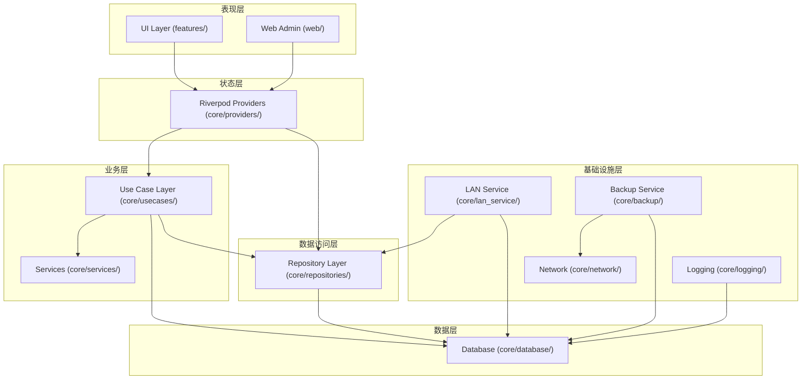

### 1.2 依赖方向规则

```
┌─────────────────────────────────────────────┐
│  UI Layer (features/, web/)                  │
│  ↓ 依赖 Riverpod                             │
├─────────────────────────────────────────────┤
│  State Layer (providers/)                    │
│  ↓ 依赖 Use Case / Repository                │
├─────────────────────────────────────────────┤
│  Business Layer (usecases/, services/)       │
│  ↓ 依赖 Repository / Database                │
├─────────────────────────────────────────────┤
│  Data Access Layer (repositories/)           │
│  ↓ 依赖 Database                             │
├─────────────────────────────────────────────┤
│  Data Layer (database/)                      │
└─────────────────────────────────────────────┘
```

**关键规则**：
- 上层可以依赖下层，下层不能依赖上层
- 同层模块可以相互依赖（但应尽量避免）
- UI 禁止直接调用 Repository（必须通过 Use Case）

---

## 2. 层级交互

### 2.1 UI 层 → Provider 层

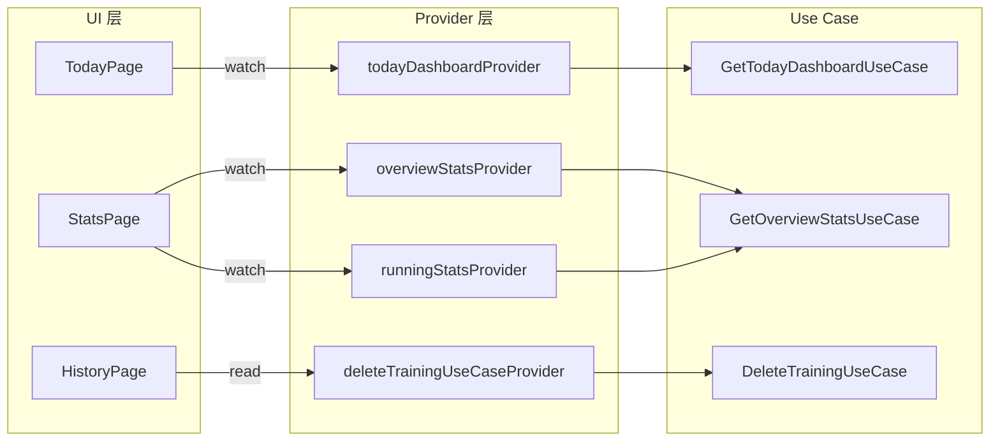

**交互模式**：

| 场景 | 方法 | 用途 |
|------|------|------|
| 显示数据 | `ref.watch(provider)` | 监听数据变化，自动重建 |
| 执行操作 | `ref.read(useCaseProvider)` | 一次性获取 Use Case 实例 |
| 触发刷新 | `ref.invalidate(provider)` | 标记 Provider 为脏，下次重建 |
| 响应式流 | `ref.watch(streamProvider)` | 监听 Stream 数据流 |

### 2.2 Provider 层 → Use Case 层

```dart
// Repository Provider
@riverpod
TrainingRepository trainingRepository(Ref ref) {
  final db = ref.watch(appDatabaseProvider);
  return TrainingRepository(db);
}

// Use Case Provider
@riverpod
DeleteTrainingUseCase deleteTrainingUseCase(Ref ref) {
  final db = ref.watch(appDatabaseProvider);
  final repo = ref.watch(trainingRepositoryProvider);
  final prRebuilder = ref.watch(rebuildPersonalRecordsUseCaseProvider);
  return DeleteTrainingUseCase(repo, db, prRebuilder);
}

// Data Provider
@riverpod
Future<TodayDashboardData> todayDashboard(Ref ref, {
  required DateTime referenceDate,
}) async {
  final useCase = ref.watch(getTodayDashboardUseCaseProvider);
  return await useCase(GetTodayDashboardParams(...));
}
```

### 2.3 Use Case 层 → Repository 层

```dart
class DeleteTrainingUseCase extends UseCase<DeleteTrainingResult, int> {
  final TrainingRepository _repository;  // 依赖 Repository
  final AppDatabase _db;                  // 依赖 Database

  @override
  Future<DeleteTrainingResult> call(int id) async {
    return await _db.transaction(() async {
      // 使用 Repository 查询
      final session = await _repository.getById(id);
      if (session == null) return DeleteTrainingResult.notFound;

      // 执行删除
      await _repository.delete(id);

      return DeleteTrainingResult.success;
    });
  }
}
```

### 2.4 Repository 层 → Database 层

```dart
class TrainingRepository {
  final AppDatabase _db;  // 依赖 Database

  Future<TrainingSession?> getById(int id) async {
    // 使用 Drift ORM 查询
    return await (_db.select(_db.trainingSessions)
          ..where((w) => w.id.equals(id)))
        .getSingleOrNull();
  }

  Stream<List<TrainingSession>> watchAll() {
    // 使用 Drift 的响应式查询
    return _db.select(_db.trainingSessions).watch();
  }
}
```

---

## 3. 核心模块依赖图

### 3.1 Use Case 依赖关系

```mermaid
flowchart TB
    subgraph TrainingUC["训练 Use Cases"]
        STS[SaveStrengthSessionUseCase]
        SRS[SaveRunningSessionUseCase]
        SWS[SaveSwimmingSessionUseCase]
        DT[DeleteTrainingUseCase]
        SW[SaveWorkoutUseCase]
    end

    subgraph PRUC["PR Use Cases"]
        RPR[RebuildPersonalRecordsUseCase]
        CSP[CheckStrengthPrUseCase]
        CRP[CheckRunningPrUseCase]
        CSwP[CheckSwimmingPrUseCase]
    end

    subgraph OtherUC["其他 Use Cases"]
        DE[DeleteExerciseUseCase]
        ST[SaveTemplateUseCase]
        DT2[DuplicateTemplateUseCase]
        GS[GetTodayDashboardUseCase]
    end

    subgraph Repos["Repositories"]
        TR[TrainingRepository]
        SER[StrengthEntryRepository]
        RR[RunningRepository]
        SWR[SwimmingRepository]
        ER[ExerciseRepository]
        TPR[TemplateRepository]
    end

    STS --> TR
    STS --> SER
    STS --> RPR
    SRS --> TR
    SRS --> RR
    SRS --> RPR
    SWS --> TR
    SWS --> SWR
    SWS --> RPR
    DT --> TR
    DT --> RPR
    SW --> TR

    RPR --> TR
    RPR --> SER
    RPR --> RR
    RPR --> SWR
    CSP --> SER
    CRP --> RR
    CSwP --> SWR

    DE --> ER
    ST --> TPR
    DT2 --> TPR
    GS --> TR
    GS --> TPR
```

### 3.2 Repository 依赖关系

```mermaid
flowchart TB
    subgraph Repositories["Repository 层"]
        TR[TrainingRepository]
        SER[StrengthEntryRepository]
        RR[RunningRepository]
        SWR[SwimmingRepository]
        ER[ExerciseRepository]
        TPR[TemplateRepository]
        SR[StatsRepository]
        SETR[SettingsRepository]
        BCR[BackupConfigRepository]
    end

    subgraph Database["数据库表"]
        TS[training_sessions]
        SE[strength_exercise_entries]
        RE[running_entries]
        RS[running_splits]
        SWE[swimming_entries]
        SWS[swimming_sets]
        EX[exercises]
        WT[workout_templates]
        TE[template_exercises]
        PR[personal_records]
        US[user_settings]
        BC[backup_configurations]
    end

    TR --> TS
    SER --> SE
    RR --> RE
    RR --> RS
    SWR --> SWE
    SWR --> SWS
    ER --> EX
    TPR --> WT
    TPR --> TE
    SR --> TS
    SR --> SE
    SETR --> US
    BCR --> BC
```

### 3.3 LAN 服务依赖关系

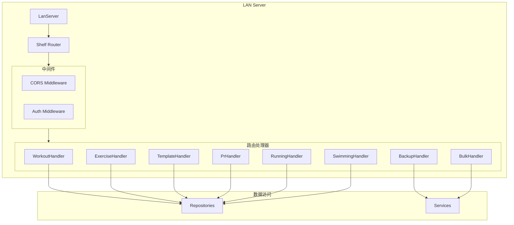

---

## 4. 数据模块交互

### 4.1 数据库表关系

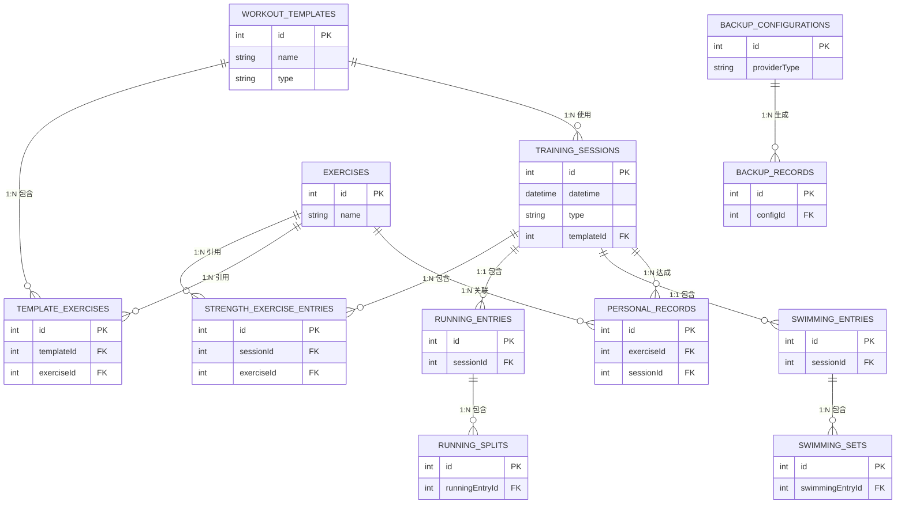

### 4.2 级联删除关系

| 父表 | 子表 | 删除行为 |
|------|------|----------|
| training_sessions | strength_exercise_entries | 级联删除 |
| training_sessions | running_entries | 级联删除 |
| running_entries | running_splits | 级联删除 |
| training_sessions | swimming_entries | 级联删除 |
| swimming_entries | swimming_sets | 级联删除 |
| workout_templates | training_sessions | setNull |
| workout_templates | template_exercises | 级联删除 |
| exercises | strength_exercise_entries | 级联删除 |
| exercises | template_exercises | 级联删除 |
| exercises | personal_records | 级联删除 |

---

## 5. 服务模块交互

### 5.1 备份服务交互

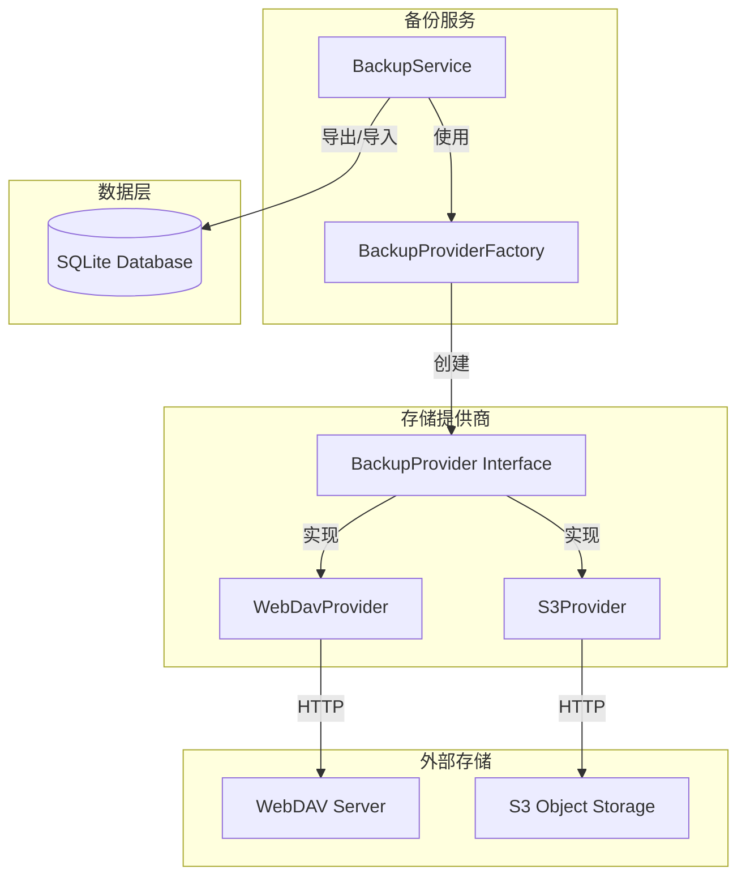

### 5.2 LAN 服务交互

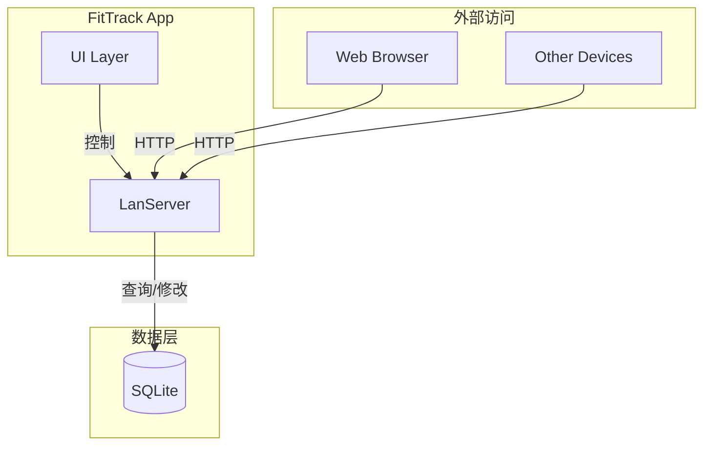

### 5.3 日志服务交互

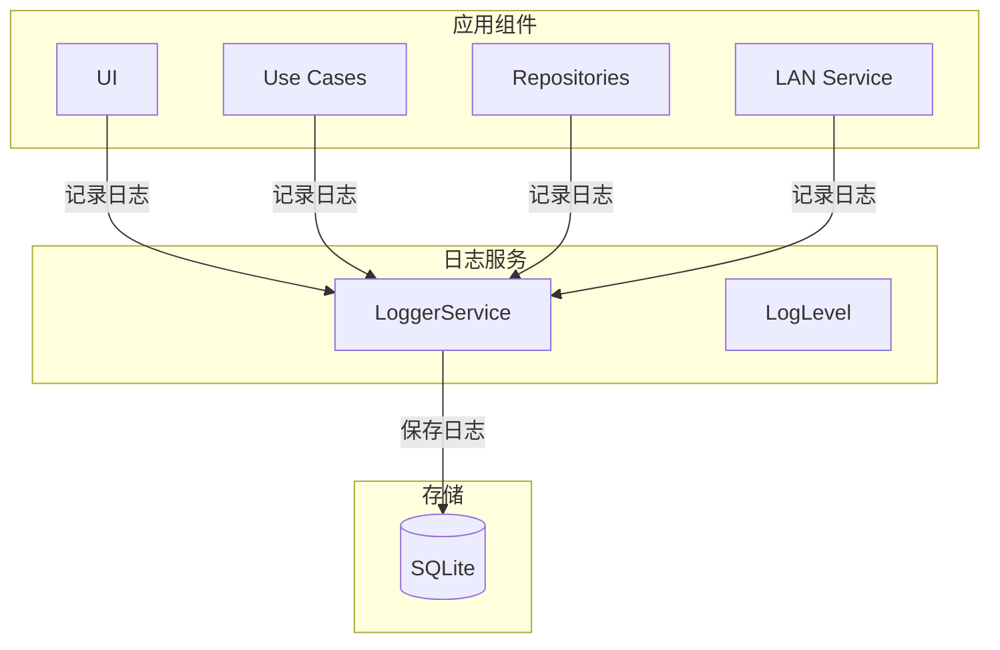

---

## 6. UI 模块交互

### 6.1 Feature 模块关系

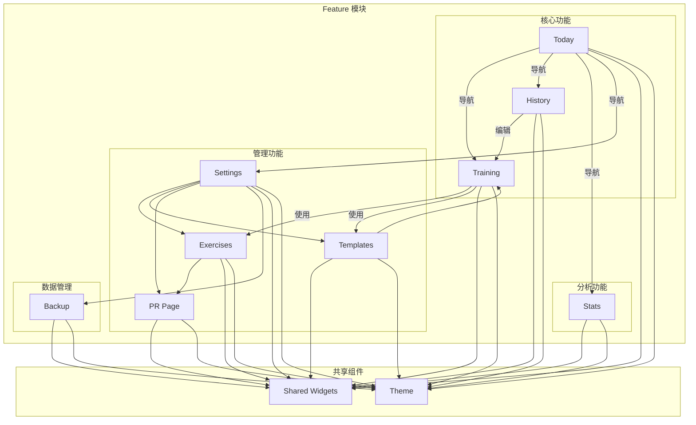

### 6.2 Web Admin 模块关系

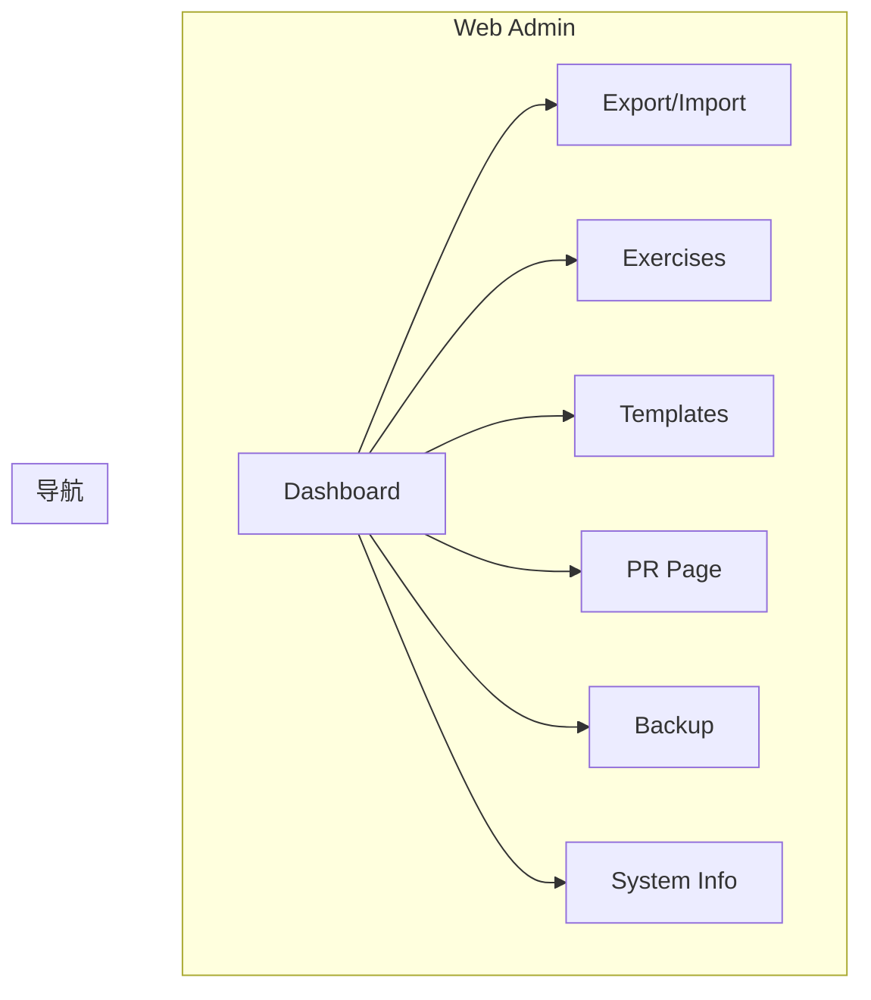

---

## 7. 交叉关注点

### 7.1 错误处理流

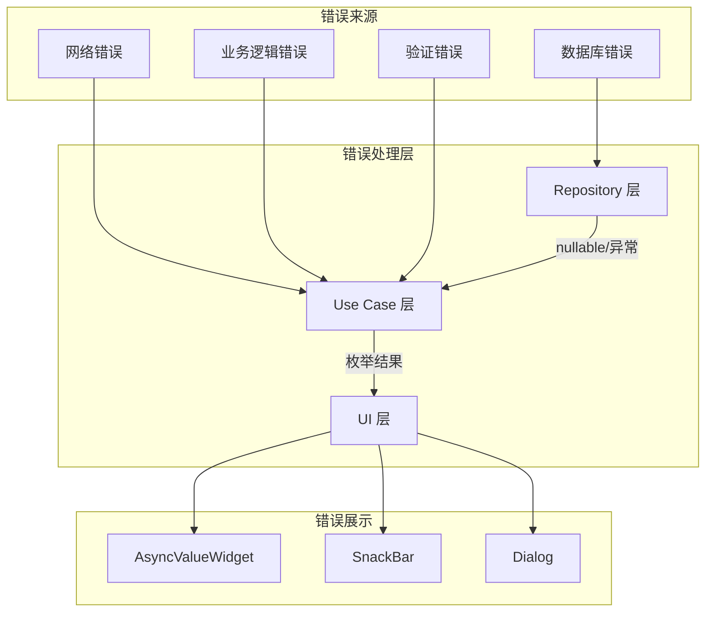

### 7.2 主题切换流

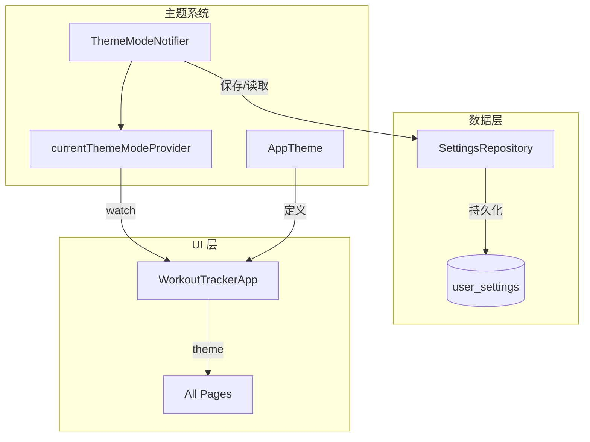

### 7.3 全局错误捕获

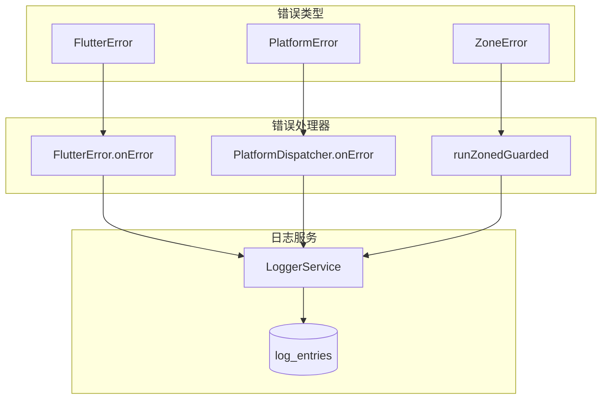

---

## 附录：模块接口清单

### Use Case 接口

| Use Case | 输入 | 输出 | 依赖 |
|----------|------|------|------|
| DeleteTrainingUseCase | int sessionId | DeleteTrainingResult | TrainingRepository, AppDatabase, RebuildPersonalRecordsUseCase |
| SaveStrengthSessionUseCase | SaveStrengthSessionParams | int sessionId | TrainingRepository, StrengthEntryRepository, AppDatabase, RebuildPersonalRecordsUseCase |
| SaveRunningSessionUseCase | SaveRunningSessionParams | int sessionId | TrainingRepository, RunningRepository, AppDatabase, RebuildPersonalRecordsUseCase |
| SaveSwimmingSessionUseCase | SaveSwimmingSessionParams | int sessionId | TrainingRepository, SwimmingRepository, AppDatabase, RebuildPersonalRecordsUseCase |
| DeleteExerciseUseCase | int exerciseId | DeleteExerciseResult | ExerciseRepository |
| SaveTemplateUseCase | SaveTemplateParams | int templateId | TemplateRepository, AppDatabase |
| RebuildPersonalRecordsUseCase | String type | void | TrainingRepository, StrengthEntryRepository, RunningRepository, SwimmingRepository, AppDatabase |
| GetTodayDashboardUseCase | GetTodayDashboardParams | TodayDashboardData | TrainingRepository, StatsRepository, SettingsRepository |

### Repository 接口

| Repository | 主要方法 |
|------------|----------|
| TrainingRepository | getById, getAll, getByDateRange, getByType, getRecent, createTraining, updateTraining, deleteTraining, watchAll, watchByType |
| StrengthEntryRepository | addStrengthExercise, getStrengthExercises, updateStrengthExercise, deleteStrengthExercise |
| RunningRepository | createEntry, getBySessionId, updateEntry, deleteEntry, addSplit, getSplits |
| SwimmingRepository | createEntry, getBySessionId, updateEntry, deleteEntry, addSet, getSets |
| ExerciseRepository | getAll, getById, create, update, delete, getByCategory |
| TemplateRepository | getAll, getById, create, update, delete, duplicate, getExercises |
| StatsRepository | getOverviewStats, getRunningStats, getSwimmingStats, getExerciseStats |
| SettingsRepository | getSettings, updateSettings, getThemeMode, updateThemeMode |

### Provider 接口

| Provider | 类型 | 用途 |
|----------|------|------|
| appDatabaseProvider | Singleton | 数据库实例 |
| trainingRepositoryProvider | Factory | TrainingRepository 实例 |
| deleteTrainingUseCaseProvider | Factory | DeleteTrainingUseCase 实例 |
| todayDashboardProvider | AutoDispose | 今日页数据 |
| overviewStatsProvider | AutoDispose | 总览统计数据 |
| themeModeProvider | KeepAlive | 主题模式状态 |

---

**文档结束**
