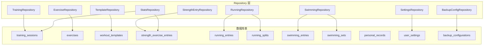
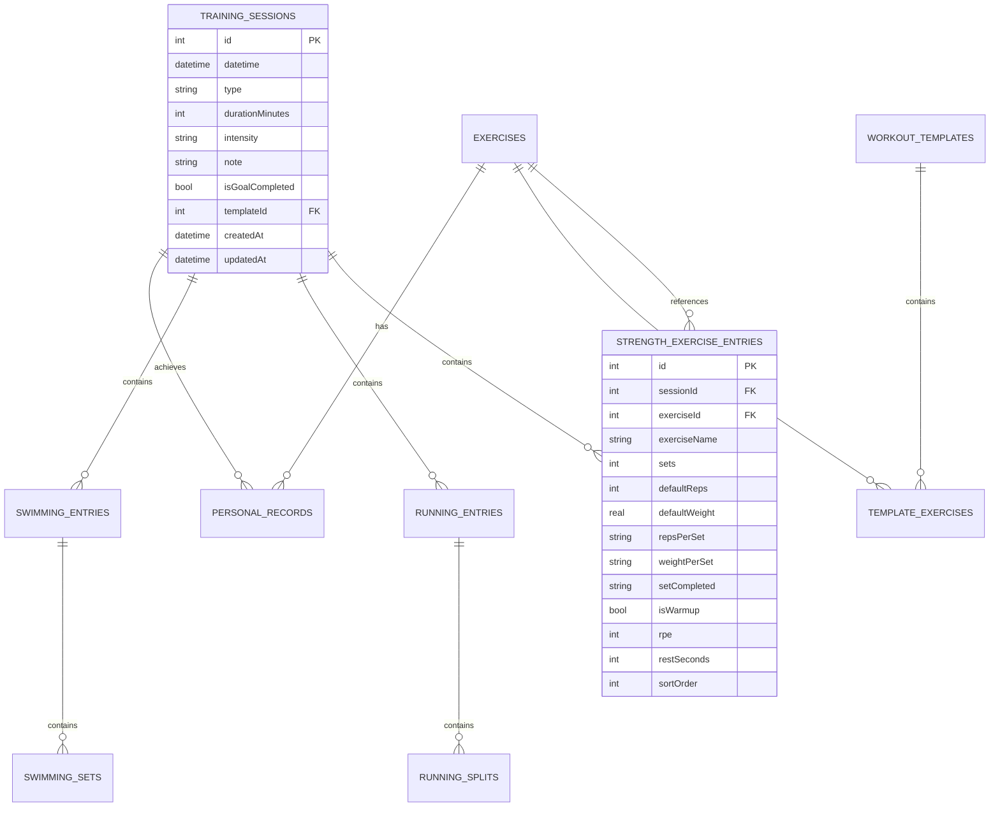
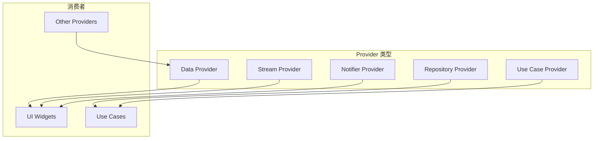
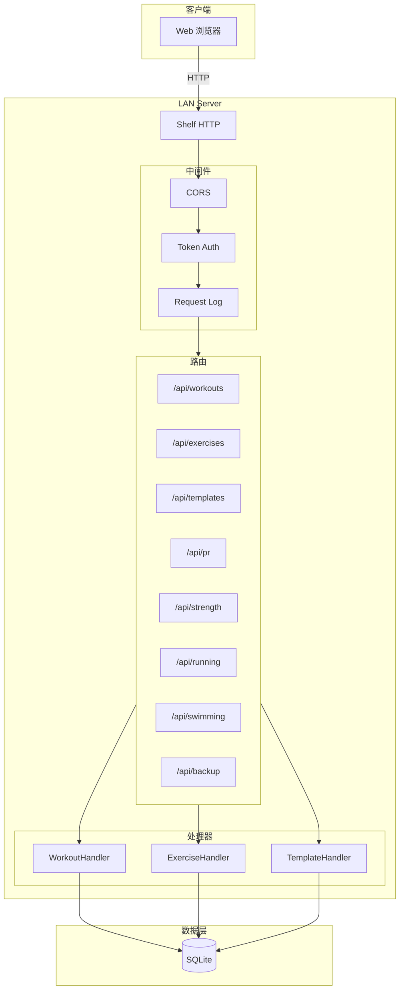
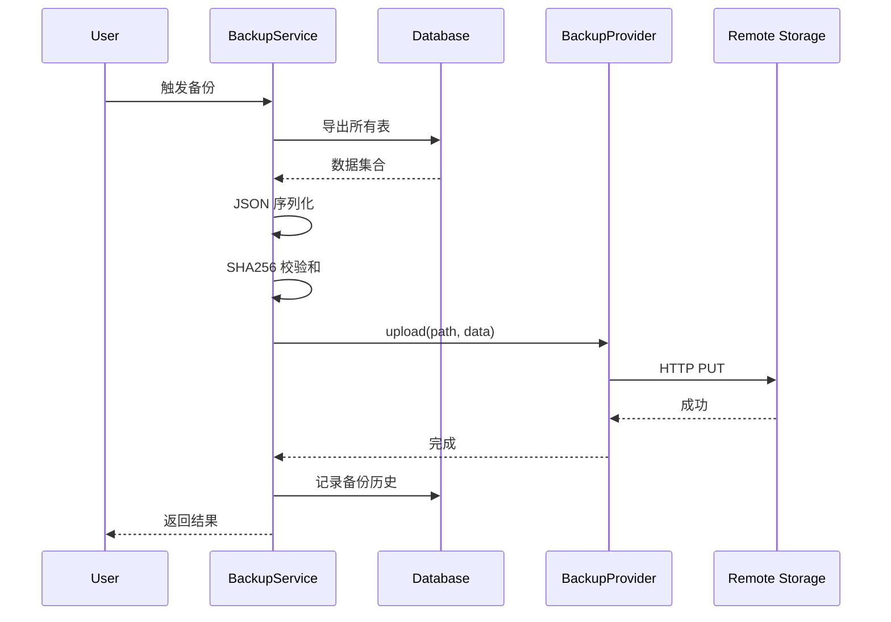
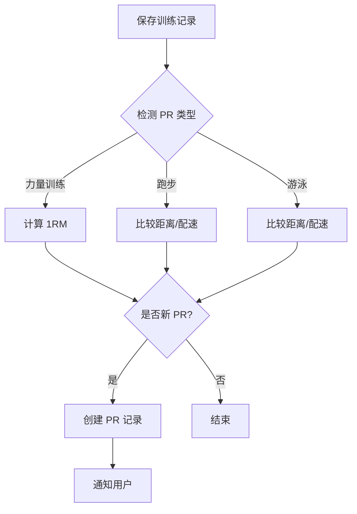

# FitTrack 核心模块详细说明

> 本文档深入解析 FitTrack 各个核心模块的设计原理、实现细节和最佳实践。
>
> **版本**: 1.0.0
> **最后更新**: 2026-03-25

---

## 目录

1. [Use Case 层详解](#1-use-case-层详解)
2. [Repository 层详解](#2-repository-层详解)
3. [数据库模块详解](#3-数据库模块详解)
4. [状态管理详解](#4-状态管理详解)
5. [LAN 服务详解](#5-lan-服务详解)
6. [备份系统详解](#6-备份系统详解)
7. [PR 系统详解](#7-pr-系统详解)

---

## 1. Use Case 层详解

### 1.1 设计哲学

Use Case 层是 FitTrack 架构的核心，它封装了所有的业务逻辑。这一层的设计遵循以下原则：

- **单一职责**：每个 Use Case 只做一件事
- **显式接口**：使用枚举明确返回结果类型
- **事务安全**：多步操作必须在事务中执行
- **可测试性**：不依赖 UI 框架，易于单元测试

### 1.2 基类设计

```dart
// lib/core/usecases/base/usecase.dart

/// Use Case 基类
/// T: 返回类型, P: 参数类型
abstract class UseCase<T, P> {
  Future<T> call(P params);
}

/// 无参数 Use Case 基类
abstract class NoParamUseCase<T> {
  Future<T> call();
}
```

### 1.3 创建时机决策树

```
是否需要创建 Use Case?
│
├─ 是简单的 CRUD 操作?
│  └─ 是 → 直接使用 Repository
│  └─ 否 → 继续判断
│
├─ 是否需要多步数据库操作?
│  └─ 是 → 创建 Use Case + 使用事务
│  └─ 否 → 继续判断
│
├─ 是否需要协调多个 Repository?
│  └─ 是 → 创建 Use Case
│  └─ 否 → 继续判断
│
├─ 是否需要业务规则验证?
│  └─ 是 → 创建 Use Case
│  └─ 否 → 继续判断
│
├─ 是否是 Check-Then-Act 模式?
│  └─ 是 → 创建 Use Case + 使用事务
│  └─ 否 → 使用 Repository
```

### 1.4 典型 Use Case 分析

#### 1.4.1 DeleteTrainingUseCase

**场景**：删除训练记录，需要级联删除关联的子记录

```dart
/// 删除训练记录结果
enum DeleteTrainingResult {
  success,
  notFound,
}

/// 删除训练记录 Use Case
/// 封装级联删除的业务决策逻辑
class DeleteTrainingUseCase extends UseCase<DeleteTrainingResult, int> {
  final TrainingRepository _repository;
  final AppDatabase _db;
  final RebuildPersonalRecordsUseCase _prRebuilder;

  DeleteTrainingUseCase(this._repository, this._db, this._prRebuilder);

  @override
  Future<DeleteTrainingResult> call(int id) async {
    return await _db.transaction(() async {
      // Step 1: 验证记录存在
      final session = await _repository.getById(id);
      if (session == null) {
        return DeleteTrainingResult.notFound;
      }

      // Step 2: 根据训练类型级联删除关联数据
      await _deleteRelatedData(id, session.type);

      // Step 3: 删除主记录
      await (_db.delete(_db.trainingSessions)
            ..where((w) => w.id.equals(id))).go();

      // Step 4: 重建该类型的 PR（删除后 PR 可能变化）
      await _prRebuilder.rebuildForTrainingType(session.type);

      return DeleteTrainingResult.success;
    });
  }

  Future<void> _deleteRelatedData(int sessionId, String type) async {
    switch (type) {
      case 'strength':
        await (_db.delete(_db.strengthExerciseEntries)
              ..where((e) => e.sessionId.equals(sessionId))).go();
        break;
      case 'running':
        final runningEntry = await (_db.select(_db.runningEntries)
              ..where((r) => r.sessionId.equals(sessionId))).getSingleOrNull();
        if (runningEntry != null) {
          await (_db.delete(_db.runningSplits)
                ..where((s) => s.runningEntryId.equals(runningEntry.id))).go();
          await (_db.delete(_db.runningEntries)
                ..where((r) => r.sessionId.equals(sessionId))).go();
        }
        break;
      case 'swimming':
        final swimmingEntry = await (_db.select(_db.swimmingEntries)
              ..where((s) => s.sessionId.equals(sessionId))).getSingleOrNull();
        if (swimmingEntry != null) {
          await (_db.delete(_db.swimmingSets)
                ..where((s) => s.swimmingEntryId.equals(swimmingEntry.id))).go();
          await (_db.delete(_db.swimmingEntries)
                ..where((s) => s.sessionId.equals(sessionId))).go();
        }
        break;
    }
  }
}
```

**设计要点**：
1. **枚举返回**：`DeleteTrainingResult` 明确告知调用者操作结果
2. **事务包装**：整个删除流程在一个事务中执行，保证数据一致性
3. **级联删除**：根据训练类型删除对应的子表数据
4. **PR 重建**：删除后自动重建该类型的 PR

#### 1.4.2 SaveStrengthSessionUseCase

**场景**：保存力量训练会话，涉及主表和多个子表

```dart
/// 力量训练动作输入
class StrengthExerciseInput {
  final int? exerciseId;
  final String exerciseName;
  final int defaultReps;
  final double defaultWeight;
  final List<int> repsPerSet;
  final List<double> weightPerSet;
  final List<bool> completedSets;
  final List<int?> rpeValues;
  final List<int?> restSecondsValues;
}

/// 保存力量训练参数
class SaveStrengthSessionParams {
  final int? sessionId;      // null = 新建，有值 = 更新
  final int? templateId;
  final DateTime startTime;
  final int elapsedSeconds;
  final String intensity;
  final String? note;
  final List<StrengthExerciseInput> exercises;
}

class SaveStrengthSessionUseCase
    extends UseCase<int, SaveStrengthSessionParams> {

  @override
  Future<int> call(SaveStrengthSessionParams params) async {
    return await _db.transaction(() async {
      final durationMinutes = (params.elapsedSeconds / 60).round();

      // Step 1: 保存/更新主会话记录
      final sessionId = await _upsertSession(params, durationMinutes);

      // Step 2: 删除旧的动作条目（更新场景）
      await (_db.delete(_db.strengthExerciseEntries)
            ..where((entry) => entry.sessionId.equals(sessionId))).go();

      // Step 3: 插入新的动作条目
      for (var i = 0; i < params.exercises.length; i++) {
        final exercise = params.exercises[i];
        await _strengthEntryRepository.addStrengthExercise(
          sessionId: sessionId,
          exerciseId: exercise.exerciseId,
          exerciseName: exercise.exerciseName,
          sets: exercise.repsPerSet.length,
          defaultReps: exercise.defaultReps,
          defaultWeight: exercise.defaultWeight > 0
              ? exercise.defaultWeight
              : null,
          repsPerSet: jsonEncode(exercise.repsPerSet),
          weightPerSet: exercise.weightPerSet.any((w) => w > 0)
              ? jsonEncode(exercise.weightPerSet)
              : null,
          setCompleted: jsonEncode(exercise.completedSets),
          rpe: _maxNonNull(exercise.rpeValues),
          restSeconds: _firstNonNull(exercise.restSecondsValues),
          sortOrder: i,
        );
      }

      // Step 4: 重建 PR
      await _prRebuilder.rebuildForTrainingType('strength');

      return sessionId;
    });
  }
}
```

**设计要点**：
1. **参数对象**：`SaveStrengthSessionParams` 封装复杂参数
2. **UPSERT 模式**：支持新建和更新两种场景
3. **全量替换**：更新时先删除旧条目再插入新条目，简化逻辑
4. **数据转换**：JSON 编码列表字段，RPE 取最大值，休息时间取第一个值

### 1.5 Use Case 最佳实践

#### 实践 1：Read-Compare-Write 模式

```dart
// 用于 PR 检测等需要防止竞态条件的场景
return await _db.transaction(() async {
  // Read: 读取当前状态
  final currentPR = await _getCurrentPR(type);

  // Compare: 比较并决定是否更新
  final isNewPR = currentPR == null || newValue > currentPR.value;

  // Write: 执行写入
  if (isNewPR) {
    await _createOrUpdatePR(type, newValue);
  }

  return PrResult(isNewPR: isNewPR, value: newValue);
});
```

#### 实践 2：Check-Then-Act 模式

```dart
// 用于删除前的引用检查
return await _db.transaction(() async {
  // Check: 检查是否存在引用
  final hasReferences = await _checkReferences(id);
  if (hasReferences) {
    return DeleteResult.hasReferences;
  }

  // Act: 执行删除
  await _repository.delete(id);
  return DeleteResult.success;
});
```

#### 实践 3：协调多个 Repository

```dart
// 当需要操作多个 Repository 时
class ComplexOperationUseCase extends UseCase<Result, Params> {
  final RepositoryA _repoA;
  final RepositoryB _repoB;
  final RepositoryC _repoC;

  @override
  Future<Result> call(Params params) async {
    return await _db.transaction(() async {
      // 协调多个 Repository 的操作
      final idA = await _repoA.create(...);
      await _repoB.create(refId: idA, ...);
      await _repoC.update(...);

      return Result.success;
    });
  }
}
```

---

## 2. Repository 层详解

### 2.1 设计原则

Repository 层是数据访问的抽象，设计原则：

- **仅数据访问**：不包含业务逻辑
- **简单查询**：仅提供基本的 CRUD 和简单查询
- **响应式支持**：提供 Stream 接口支持响应式 UI
- **可替换性**：便于测试时 mock

### 2.2 Repository vs Use Case 职责对比

| 职责 | Repository | Use Case |
|------|------------|----------|
| 单条 CRUD | ✅ | ✅ |
| 简单查询 | ✅ | ❌ |
| 响应式流 | ✅ | ❌ |
| 跨表操作 | ❌ | ✅ |
| 业务验证 | ❌ | ✅ |
| 事务协调 | ❌ | ✅ |

### 2.3 典型 Repository 实现

```dart
/// 训练记录 Repository
/// 提供训练会话的 CRUD 操作和查询方法
class TrainingRepository {
  final AppDatabase _db;

  TrainingRepository(this._db);

  /// 创建训练记录
  Future<int> createTraining({
    required DateTime datetime,
    required String type,
    required int durationMinutes,
    required String intensity,
    String? note,
    bool isGoalCompleted = false,
    int? templateId,
  }) async {
    return await _db
        .into(_db.trainingSessions)
        .insert(TrainingSessionsCompanion(...));
  }

  /// 根据ID获取训练记录
  Future<TrainingSession?> getById(int id) async {
    return await (_db.select(_db.trainingSessions)
          ..where((w) => w.id.equals(id)))
        .getSingleOrNull();
  }

  /// 按日期范围获取记录
  Future<List<TrainingSession>> getByDateRange(
    DateTime start,
    DateTime end,
  ) async {
    return await (_db.select(_db.trainingSessions)
          ..where((w) => w.datetime.isBetweenValues(start, end))
          ..orderBy([(w) => OrderingTerm.desc(w.datetime)]))
        .get();
  }

  /// 响应式查询 - 监听所有记录
  Stream<List<TrainingSession>> watchAll() {
    return _db.select(_db.trainingSessions).watch();
  }

  /// 响应式查询 - 监听指定类型
  Stream<List<TrainingSession>> watchByType(String type) {
    return (_db.select(_db.trainingSessions)
          ..where((w) => w.type.equals(type))
          ..orderBy([(w) => OrderingTerm.desc(w.datetime)]))
        .watch();
  }
}
```

### 2.4 Repository 列表



---

## 3. 数据库模块详解

### 3.1 表结构关系



### 3.2 索引设计

#### 索引策略原则

1. **等值查询在前**：复合索引中等值查询字段放在前面
2. **范围查询在后**：范围查询或排序字段放在后面
3. **覆盖索引**：考虑覆盖查询，避免回表

#### 索引清单

| 索引名称 | 表 | 字段 | 用途 |
|----------|------|------|------|
| idx_sessions_datetime | training_sessions | datetime | 时间范围查询 |
| idx_sessions_type | training_sessions | type | 类型过滤 |
| idx_sessions_type_datetime | training_sessions | type + datetime | 组合查询 |
| idx_strength_session | strength_exercise_entries | sessionId | 级联删除 |
| idx_strength_exercise | strength_exercise_entries | exerciseId | PR 计算 |
| idx_pr_exercise | personal_records | exerciseId | PR 查询 |
| idx_pr_type_exercise | personal_records | recordType + exerciseId | PR 筛选 |

### 3.3 外键约束

```dart
// 强制外键 - 删除父记录时会报错
IntColumn get sessionId =>
    integer().references(TrainingSessions, #id)();

// 可选外键 - 允许 null
IntColumn get exerciseId =>
    integer().nullable().references(Exercises, #id)();

// 级联设空 - 父记录删除时自动设为 null
IntColumn get templateId =>
    integer()
    .nullable()
    .references(WorkoutTemplates, #id, onDelete: KeyAction.setNull)();
```

### 3.4 查询优化

#### 3.4.1 SQL 聚合（推荐）

```dart
// ✅ 正确: 使用 SQL 聚合
final query = _db.selectOnly(_db.trainingSessions)
  ..addColumns([
    _db.trainingSessions.type,
    _db.trainingSessions.id.count(),
  ])
  ..groupBy([_db.trainingSessions.type]);

final results = await query.get();
for (final row in results) {
  final type = row.read(_db.trainingSessions.type);
  final count = row.read(_db.trainingSessions.id.count());
}
```

#### 3.4.2 内存聚合（避免）

```dart
// ❌ 错误: 内存聚合
final all = await _db.select(_db.trainingSessions).get();
final counts = <String, int>{};
for (final session in all) {
  counts[session.type] = (counts[session.type] ?? 0) + 1;
}
```

---

## 4. 状态管理详解

### 4.1 Riverpod 架构



### 4.2 Provider 分类

| Provider 类型 | 注解 | 用途 | 示例 |
|---------------|------|------|------|
| Repository | `@riverpod` | 提供 Repository 实例 | `trainingRepositoryProvider` |
| Use Case | `@riverpod` | 提供 Use Case 实例 | `deleteTrainingUseCaseProvider` |
| Data | `@riverpod` | 异步数据查询 | `overviewStatsProvider` |
| Stream | `@riverpod` | 响应式数据流 | `watchAllSessionsProvider` |
| Notifier | `@Riverpod` | 可变状态管理 | `ThemeModeNotifier` |

### 4.3 代码生成示例

```dart
// Repository Provider
@riverpod
TrainingRepository trainingRepository(Ref ref) {
  final db = ref.watch(appDatabaseProvider);
  return TrainingRepository(db);
}

// Use Case Provider
@riverpod
DeleteTrainingUseCase deleteTrainingUseCase(Ref ref) {
  final db = ref.watch(appDatabaseProvider);
  final repo = ref.watch(trainingRepositoryProvider);
  final prRebuilder = ref.watch(rebuildPersonalRecordsUseCaseProvider);
  return DeleteTrainingUseCase(repo, db, prRebuilder);
}

// Data Provider
@riverpod
Future<OverviewStats> overviewStats(Ref ref) async {
  final useCase = ref.watch(getOverviewStatsUseCaseProvider);
  return await useCase();
}

// Stream Provider
@riverpod
Stream<List<TrainingSession>> watchAllSessions(Ref ref) {
  final repo = ref.watch(trainingRepositoryProvider);
  return repo.watchAll();
}

// Notifier Provider
@Riverpod(keepAlive: true)
class ThemeModeNotifier extends _$ThemeModeNotifier {
  @override
  Future<ThemeMode> build() async {
    final settingsRepo = ref.watch(settingsRepositoryProvider);
    final mode = await settingsRepo.getThemeMode();
    return _themeModeFromStorage(mode);
  }

  Future<void> setThemeMode(ThemeModeOption mode) async {
    // ... 实现
  }
}
```

### 4.4 UI 使用模式

```dart
class TodayPage extends ConsumerWidget {
  @override
  Widget build(BuildContext context, WidgetRef ref) {
    // 监听异步数据
    final dashboardAsync = ref.watch(
      todayDashboardProvider(referenceDate: DateTime.now()),
    );

    return AsyncValueWidget<TodayDashboardData>(
      asyncValue: dashboardAsync,
      retryAction: () => ref.invalidate(todayDashboardProvider),
      dataBuilder: (dashboard) => _buildContent(dashboard),
    );
  }

  void _handleDelete(BuildContext context, WidgetRef ref, int id) async {
    // 读取 Use Case 并执行
    final useCase = ref.read(deleteTrainingUseCaseProvider);
    final result = await useCase(id);

    switch (result) {
      case DeleteTrainingResult.success:
        // 成功处理
        break;
      case DeleteTrainingResult.notFound:
        // 未找到处理
        break;
    }
  }
}
```

---

## 5. LAN 服务详解

### 5.1 架构图



### 5.2 中间件链

```dart
final handler = const Pipeline()
    .addMiddleware(logRequests())        // 日志
    .addMiddleware(_corsMiddleware())    // CORS
    .addMiddleware(authMiddleware(token)) // 认证
    .addHandler(router.call);
```

### 5.3 API 路由清单

| 路由 | 方法 | 描述 |
|------|------|------|
| `/health` | GET | 健康检查 |
| `/api/workouts` | GET/POST | 训练记录列表/创建 |
| `/api/workouts/<id>` | GET/PUT/DELETE | 训练记录操作 |
| `/api/exercises` | GET/POST | 动作库 |
| `/api/templates` | GET/POST | 训练模板 |
| `/api/pr` | GET | 个人记录 |
| `/api/strength/<sessionId>` | GET/POST | 力量训练条目 |
| `/api/running` | GET | 跑步记录 |
| `/api/swimming` | GET | 游泳记录 |
| `/api/backup` | POST | 执行备份 |
| `/api/export/json` | GET | 导出数据 |
| `/api/import/json` | POST | 导入数据 |

---

## 6. 备份系统详解

### 6.1 备份流程



### 6.2 备份数据结构

```json
{
  "version": "2.0.0",
  "exportDate": "2026-03-25T10:30:00Z",
  "workouts": [...],
  "strengthExercises": [...],
  "runningEntries": [...],
  "runningSplits": [...],
  "swimmingEntries": [...],
  "swimmingSets": [...],
  "templates": [...],
  "templateExercises": [...],
  "exercises": [...],
  "personalRecords": [...],
  "settings": [...],
  "backupConfigs": [...],
  "backupRecords": [...]
}
```

### 6.3 备份提供商接口

```dart
abstract class BackupProvider {
  /// 上传文件
  Future<void> upload(String path, Uint8List data);

  /// 下载文件
  Future<Uint8List> download(String path);

  /// 列出文件
  Future<List<RemoteFile>> listFiles(String path);

  /// 删除文件
  Future<void> delete(String path);
}

// WebDAV 实现
class WebDavProvider implements BackupProvider {
  final String endpoint;
  final String username;
  final String password;

  @override
  Future<void> upload(String path, Uint8List data) async {
    // WebDAV PUT 实现
  }

  // ... 其他方法
}

// S3 实现
class S3Provider implements BackupProvider {
  final String endpoint;
  final String bucket;
  final String accessKey;
  final String secretKey;

  @override
  Future<void> upload(String path, Uint8List data) async {
    // S3 PUT 实现
  }

  // ... 其他方法
}
```

---

## 7. PR 系统详解

### 7.1 PR 类型

| 类型 | 说明 | 计算方式 |
|------|------|----------|
| strength_1rm | 最大重量 | Epley 公式估算 |
| strength_volume | 最大容量 | 重量 × 次数 |
| running_distance | 最远距离 | 单次跑步距离 |
| running_pace | 最快配速 | 最快速度 |
| swimming_distance | 最远距离 | 单次游泳距离 |
| swimming_pace | 最快配速 | 最快每百米速度 |

### 7.2 PR 检测流程



### 7.3 1RM 计算公式

```dart
/// Epley 公式计算 1RM
/// 1RM = weight * (1 + reps / 30)
class OneRmCalculator {
  static double calculate(double weight, int reps) {
    if (reps <= 0 || weight <= 0) return 0.0;
    if (reps == 1) return weight;
    return weight * (1 + reps / 30);
  }
}
```

### 7.4 PR 重建流程

当删除训练记录时，需要重建 PR：

```dart
class RebuildPersonalRecordsUseCase {
  Future<void> rebuildForTrainingType(String type) async {
    // 1. 清空该类型的现有 PR
    await _clearPRsForType(type);

    // 2. 查询所有该类型的训练记录
    final sessions = await _getSessionsByType(type);

    // 3. 重新计算 PR
    for (final session in sessions) {
      await _checkAndRecordPR(session);
    }
  }
}
```

---

## 附录：术语表

| 术语 | 说明 |
|------|------|
| Use Case | 用例，封装业务逻辑的类 |
| Repository | 仓库，数据访问抽象 |
| Provider | Riverpod 中的状态提供者 |
| PR | Personal Record，个人最好成绩 |
| 1RM | One Rep Max，单次最大重量 |
| RPE | Rate of Perceived Exertion，主观强度感受 |
| UPSERT | 更新或插入操作 |

---

**文档结束**
