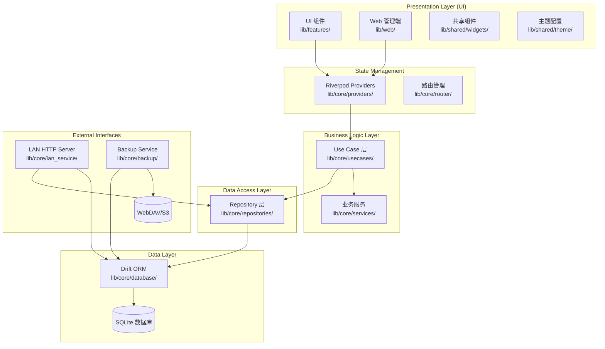
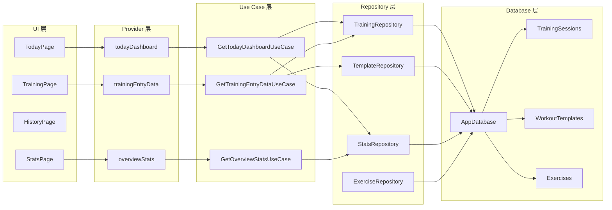
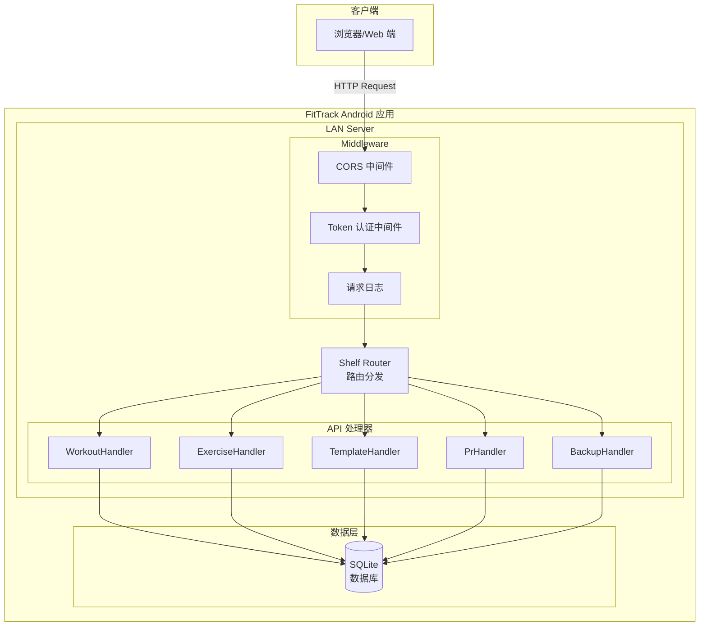
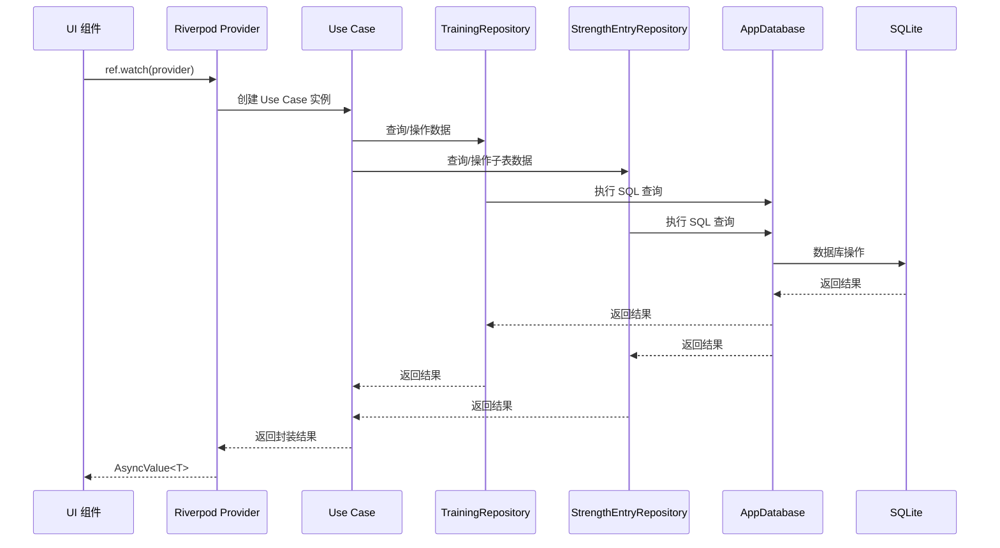
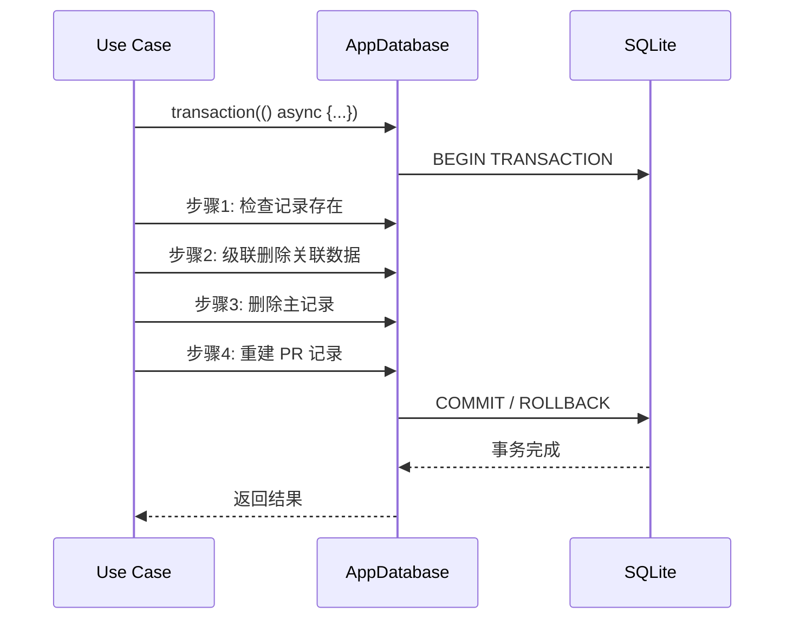
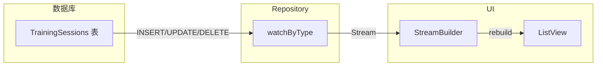
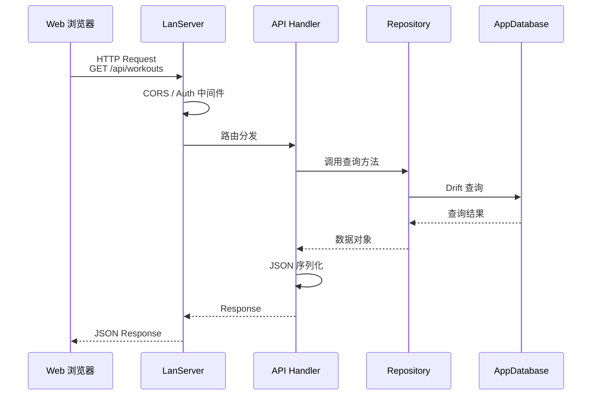
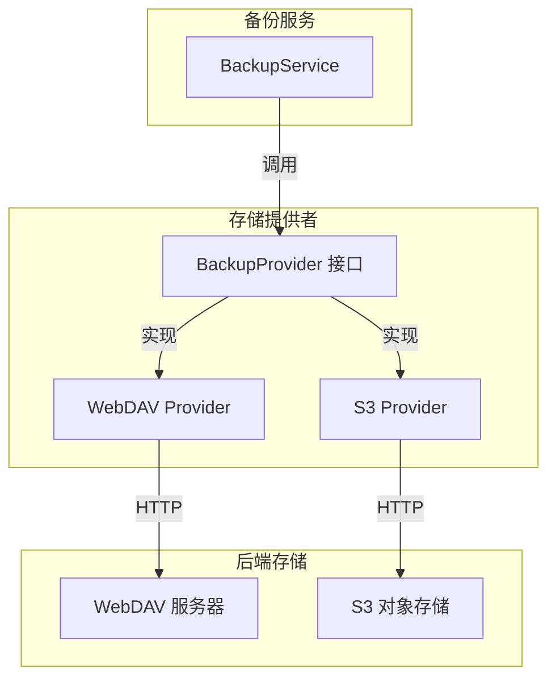
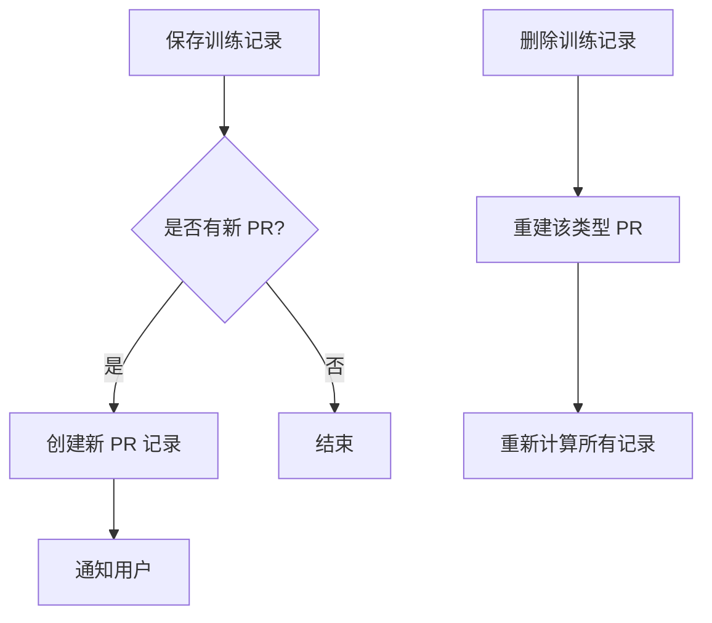

# FitTrack 架构文档

> 本文档描述 FitTrack Flutter 健身记录应用的整体架构设计、分层模式和核心实现细节。
>
> 版本：2.0.0
> 最后更新：2025-03

---

## 目录

1. [系统概述](#1-系统概述)
2. [系统架构图](#2-系统架构图)
3. [各层职责说明](#3-各层职责说明)
4. [数据流说明](#4-数据流说明)
5. [核心模块说明](#5-核心模块说明)
6. [技术选型说明](#6-技术选型说明)
7. [项目结构](#7-项目结构)
8. [性能优化](#8-性能优化)
9. [安全设计](#9-安全设计)
10. [扩展性设计](#10-扩展性设计)

---

## 1. 系统概述

FitTrack 是一款 Flutter 健身记录应用，支持力量训练、跑步、游泳等多种运动类型。采用**本地优先架构**，所有数据存储在本地 SQLite 数据库，同时提供**局域网 HTTP API 服务**供 Web 端访问。

### 核心设计原则

- **Android 为中心**：所有业务数据存储在 Android 端，Web 端仅作为数据展示和管理界面
- **离线优先**：应用在无网络环境下完全可用
- **分层架构**：清晰的 UI -> Use Case -> Repository -> Database 分层
- **类型安全**：使用 Drift ORM 和 Riverpod 代码生成实现编译时安全
- **响应式 UI**：Stream 数据流驱动 UI 自动更新

### 技术栈

| 层级 | 技术 | 版本 | 用途 |
|------|------|------|------|
| 框架 | Flutter | 3.32+ | 跨平台 UI 框架 |
| 语言 | Dart | 3.11+ | 开发语言 |
| 数据库 | Drift | 2.31+ | SQLite ORM |
| 状态管理 | Riverpod | 3.2+ | 依赖注入和状态管理 |
| 路由 | go_router | 17.1+ | 页面导航 |
| HTTP 服务 | shelf | 1.4+ | 局域网 HTTP 服务 |
| 图表 | fl_chart | 1.2+ | 数据可视化 |

---

## 2. 系统架构图

### 2.1 整体分层架构



### 2.2 组件依赖关系



### 2.3 LAN 服务架构



---

## 3. 各层职责说明

### 3.1 UI 层 (lib/features/)

**职责**：用户界面渲染和用户交互处理

**设计原则**：
- 使用 **Material 3** 设计系统 (`useMaterial3: true`)
- 状态驱动 UI，通过 Riverpod Provider 监听状态变化
- **禁止直接操作 Repository**，业务操作必须通过 Use Case 执行
- 使用共享组件：`AsyncValueWidget`、`LoadingIndicator`、`EmptyStateWidget`

**目录结构**：
```
lib/features/
├── today/           # 今日概览页面
├── training/        # 训练记录页面
│   ├── strength/    # 力量训练表单
│   ├── running/     # 跑步训练表单
│   └── swimming/    # 游泳训练表单
├── history/         # 训练历史（按类型分页面）
├── stats/           # 统计分析
│   ├── overview_stats_page.dart
│   ├── running_stats_page.dart
│   └── swimming_stats_page.dart
├── exercises/       # 动作库管理
├── templates/       # 训练模板管理
├── pr/              # 个人记录查看
├── backup/          # 备份管理
└── settings/        # 设置页面
```

### 3.2 状态管理层 (lib/core/providers/)

**职责**：状态管理和依赖注入

**使用 Riverpod 3.x**：
- **Repository Provider**：提供 Repository 实例
- **Use Case Provider**：提供 Use Case 实例，自动注入依赖
- **Data Provider**：暴露异步数据，自动处理 loading/error 状态
- **Stream Provider**：提供响应式数据流

**代码生成示例**：
```dart
@riverpod
DeleteTrainingUseCase deleteTrainingUseCase(Ref ref) {
  final db = ref.watch(appDatabaseProvider);
  final repo = ref.watch(trainingRepositoryProvider);
  final prRebuilder = ref.watch(personalRecordsRebuildUseCaseProvider);
  return DeleteTrainingUseCase(repo, db, prRebuilder);
}

@riverpod
Future<TodayDashboardData> todayDashboard(Ref ref, {
  required DateTime referenceDate,
  int recentLimit = 3,
}) async {
  final useCase = ref.watch(getTodayDashboardUseCaseProvider);
  return await useCase(GetTodayDashboardParams(
    referenceDate: referenceDate,
    recentLimit: recentLimit,
  ));
}
```

### 3.3 业务逻辑层 (lib/core/usecases/)

**职责**：封装核心业务逻辑

**必须创建 Use Case 的场景**：
1. 多步数据库操作（涉及多个表）
2. 协调多个 Repository
3. 业务规则验证
4. Read-Compare-Write 模式（防止竞态条件）
5. Check-Then-Act 操作

**Use Case 基类**：
```dart
/// T: 返回类型, P: 参数类型
abstract class UseCase<T, P> {
  Future<T> call(P params);
}

/// 无参数 Use Case 基类
abstract class NoParamUseCase<T> {
  Future<T> call();
}
```

**结果枚举模式**：
```dart
enum DeleteTrainingResult {
  success,
  notFound,
}

enum DeleteExerciseResult {
  success,
  hasStrengthReferences,  // 存在力量训练引用
  hasTemplateReferences,  // 存在模板引用
  notFound,
}
```

**参数对象模式**：
```dart
class SaveStrengthSessionParams {
  final DateTime datetime;
  final int? templateId;
  final List<StrengthEntryParams> entries;

  const SaveStrengthSessionParams({
    required this.datetime,
    this.templateId,
    required this.entries,
  });
}
```

**事务包装模式**：
```dart
@override
Future<DeleteTrainingResult> call(int id) async {
  return await _db.transaction(() async {
    // Step 1: 检查记录存在
    final session = await _repository.getById(id);
    if (session == null) return DeleteTrainingResult.notFound;

    // Step 2: 级联删除关联数据
    await _deleteRelatedData(id, session.type);

    // Step 3: 删除主记录
    await _repository.delete(id);

    // Step 4: 重建 PR
    await _prRebuilder.rebuildForTrainingType(session.type);

    return DeleteTrainingResult.success;
  });
}
```

### 3.4 数据访问层 (lib/core/repositories/)

**职责**：数据访问抽象

**Repository 仅负责**：
- CRUD 操作
- 简单查询（带过滤、排序、分页）
- 响应式数据流 (`watchAll()` 返回 `Stream`)

**Repository 禁止包含**：
- 业务逻辑验证
- 多步操作协调
- 跨表操作

**示例**：
```dart
class TrainingRepository {
  /// 根据ID获取训练记录
  Future<TrainingSession?> getById(int id) async {
    return await (_db.select(_db.trainingSessions)
          ..where((w) => w.id.equals(id)))
        .getSingleOrNull();
  }

  /// 响应式查询
  Stream<List<TrainingSession>> watchAll() {
    return _db.select(_db.trainingSessions).watch();
  }
}
```

### 3.5 数据层 (lib/core/database/)

**职责**：数据持久化

**使用 Drift 2.x 作为 SQLite ORM**

**表定义规范**：
- 所有外键字段必须使用 `.references()` 建立约束
- 高频查询字段必须使用 `@TableIndex` 建立索引
- 表和字段添加中文注释

**外键约束示例**：
```dart
IntColumn get templateId => integer()
    .nullable()
    .references(WorkoutTemplates, #id, onDelete: KeyAction.setNull)();

IntColumn get sessionId => integer().references(TrainingSessions, #id)();
```

**索引规范**：
```dart
@TableIndex(name: 'idx_sessions_datetime', columns: {#datetime})
@TableIndex(name: 'idx_sessions_type_datetime', columns: {#type, #datetime})
class TrainingSessions extends Table {
  IntColumn get id => integer().autoIncrement()();
  IntColumn get type => integer()();
  DateTimeColumn get datetime => dateTime()();
}
```

**数据表清单**：

| 表名 | 用途 | 主要外键 |
|------|------|----------|
| `training_sessions` | 训练会话主表 | `template_id` |
| `strength_exercise_entries` | 力量训练条目 | `session_id`, `exercise_id` |
| `running_entries` | 跑步记录 | `session_id` |
| `running_splits` | 跑步分段 | `running_entry_id` |
| `swimming_entries` | 游泳记录 | `session_id` |
| `swimming_sets` | 游泳组详情 | `swimming_entry_id` |
| `exercises` | 动作库 | - |
| `workout_templates` | 训练模板 | - |
| `template_exercises` | 模板动作 | `template_id`, `exercise_id` |
| `personal_records` | 个人记录 | `exercise_id`, `session_id` |
| `user_settings` | 用户设置 | - |
| `backup_configurations` | 备份配置 | - |
| `backup_records` | 备份历史 | `config_id` |

---

## 4. 数据流说明

### 4.1 标准数据流



### 4.2 事务处理流程



### 4.3 响应式数据流



### 4.4 LAN API 数据流



---

## 5. 核心模块说明

### 5.1 局域网 HTTP 服务 (lib/core/lan_service/)

**基于 Shelf 框架构建的 HTTP 服务器**

**中间件层**：
| 中间件 | 功能 |
|--------|------|
| CORS Middleware | 跨域支持 |
| Auth Middleware | Token 认证 |
| Log Middleware | 请求日志 |

**API 路由清单**：

| 路由 | 方法 | 用途 |
|------|------|------|
| `/health` | GET | 健康检查 |
| `/api/workouts` | GET/POST | 训练记录列表/创建 |
| `/api/workouts/<id>` | GET/PUT/DELETE | 单条训练记录操作 |
| `/api/exercises` | GET/POST | 动作库列表/创建 |
| `/api/exercises/<id>` | GET/PUT/DELETE | 单条动作操作 |
| `/api/templates` | GET/POST | 模板列表/创建 |
| `/api/templates/<id>` | GET/PUT/DELETE | 单条模板操作 |
| `/api/pr` | GET | 个人记录列表 |
| `/api/pr/<type>` | GET | 按类型获取 PR |
| `/api/running` | GET | 跑步记录列表 |
| `/api/running/<id>` | GET | 单条跑步记录 |
| `/api/swimming` | GET | 游泳记录列表 |
| `/api/strength/<sessionId>` | GET/POST | 力量训练条目 |
| `/api/export/json` | GET | 导出 JSON |
| `/api/import/json` | POST | 导入 JSON |
| `/api/backup` | POST | 执行备份 |
| `/api/restore` | POST | 执行恢复 |

### 5.2 备份服务 (lib/core/backup/)

**支持多存储后端的备份恢复系统**

**架构**：


**备份流程**：
1. 导出数据库所有表为 JSON
2. 计算 SHA-256 校验和
3. 上传到远程存储
4. 记录备份历史

**恢复流程**：
1. 从远程存储下载备份文件
2. 验证 SHA-256 校验和
3. 在事务中清空并重新导入数据
4. 重建个人记录

### 5.3 个人记录 (PR) 系统

**自动识别和记录用户个人最佳成绩**

**PR 类型**：
- 力量训练：最大重量（按动作）
- 跑步：最快速度、最远距离、最长时长
- 游泳：最快速度、最远距离

**检测流程**：


### 5.4 主题系统

**支持亮色/暗色/跟随系统三种模式**

**使用 Material 3 设计系统**：

```dart
class AppTheme {
  static ThemeData get darkTheme { ... }
  static ThemeData get lightTheme { ... }
}

@Riverpod(keepAlive: true)
class ThemeModeNotifier extends _$ThemeModeNotifier {
  @override
  Future<ThemeMode> build() async { ... }
  Future<void> setThemeMode(ThemeModeOption mode) async { ... }
}
```

---

## 6. 技术选型说明

### 6.1 核心依赖

| 依赖 | 版本 | 用途 |
|------|------|------|
| flutter | 3.32+ | UI 框架 |
| dart | 3.11+ | 编程语言 |
| drift | 2.31+ | SQLite ORM |
| riverpod | 3.2+ | 状态管理 |
| go_router | 17.1+ | 路由导航 |
| shelf | 1.4+ | HTTP 服务器 |
| fl_chart | 1.2+ | 图表组件 |

### 6.2 数据库技术 (Drift)

**选型理由**：
- 类型安全的 SQL 查询
- 代码生成减少样板代码
- 支持响应式查询 (Stream)
- 跨平台支持 (iOS/Android/Web)
- 事务支持

**关键特性**：
```dart
// 类型安全查询
final results = await _db.select(_db.trainingSessions)
  ..where((w) => w.type.equals('strength'))
  ..orderBy([(w) => OrderingTerm.desc(w.datetime)])
  .get();

// 响应式查询
Stream<List<TrainingSession>> watchAll() {
  return _db.select(_db.trainingSessions).watch();
}

// 事务支持
await _db.transaction(() async {
  // 多步操作
});
```

### 6.3 状态管理 (Riverpod)

**选型理由**：
- 编译时安全，避免运行时错误
- 代码生成简化 Provider 定义
- 自动处理异步状态 (AsyncValue)
- 依赖注入简单直观
- 支持热重载

**使用模式**：
```dart
// 自动生成的 Provider
@riverpod
DeleteTrainingUseCase deleteTrainingUseCase(Ref ref) {
  final db = ref.watch(appDatabaseProvider);
  final repo = ref.watch(trainingRepositoryProvider);
  return DeleteTrainingUseCase(repo, db);
}

// 数据 Provider
@riverpod
Future<TodayDashboardData> todayDashboard(Ref ref, { ... }) async {
  final useCase = ref.watch(getTodayDashboardUseCaseProvider);
  return await useCase(params);
}
```

### 6.4 路由导航 (go_router)

**选型理由**：
- 声明式路由配置
- 支持嵌套路由
- 类型安全的路由参数
- 与 Riverpod 良好集成

### 6.5 HTTP 服务 (Shelf)

**选型理由**：
- 轻量级，适合嵌入式服务器
- 中间件支持
- 与 Dart 生态良好集成
- 支持路由分组

---

## 7. 项目结构

```
lib/
├── main.dart                    # 应用入口（全局错误处理、初始化）
├── app.dart                     # 应用主组件（主题、路由配置）
├── core/                        # 核心业务层（不依赖 UI）
│   ├── backup/                  # 备份服务
│   │   ├── backup_service.dart
│   │   ├── backup_provider.dart
│   │   ├── backup_verifier.dart
│   │   └── providers/
│   │       ├── webdav_provider.dart
│   │       └── s3_provider.dart
│   ├── database/                # 数据库层（Drift）
│   │   ├── database.dart        # 数据库主类
│   │   ├── tables/              # 数据表定义
│   │   │   ├── training_sessions.dart
│   │   │   ├── strength_exercise_entries.dart
│   │   │   ├── running_entries.dart
│   │   │   ├── running_splits.dart
│   │   │   ├── swimming_entries.dart
│   │   │   ├── swimming_sets.dart
│   │   │   ├── exercises.dart
│   │   │   ├── workout_templates.dart
│   │   │   ├── template_exercises.dart
│   │   │   ├── personal_records.dart
│   │   │   ├── user_settings.dart
│   │   │   ├── backup_configurations.dart
│   │   │   └── backup_records.dart
│   │   └── seed/                # 种子数据
│   ├── lan_service/             # 局域网 HTTP 服务
│   │   ├── lan_server.dart
│   │   ├── routes/              # API 路由
│   │   │   ├── workout_routes.dart
│   │   │   ├── exercise_routes.dart
│   │   │   ├── template_routes.dart
│   │   │   ├── pr_routes.dart
│   │   │   ├── running_routes.dart
│   │   │   ├── swimming_routes.dart
│   │   │   ├── strength_routes.dart
│   │   │   ├── backup_routes.dart
│   │   │   ├── settings_routes.dart
│   │   │   └── bulk_routes.dart
│   │   └── middleware/          # 中间件
│   │       ├── auth_middleware.dart
│   │       └── coop_coep_middleware.dart
│   ├── logging/                 # 日志服务
│   ├── network/                 # 网络信息
│   ├── providers/               # Riverpod Providers
│   │   ├── usecase_providers.dart
│   │   └── app_database_provider.dart
│   ├── repositories/            # 数据仓库层
│   │   ├── training_repository.dart
│   │   ├── exercise_repository.dart
│   │   ├── template_repository.dart
│   │   ├── strength_entry_repository.dart
│   │   ├── running_repository.dart
│   │   ├── swimming_repository.dart
│   │   ├── stats_repository.dart
│   │   ├── training_stats_repository.dart
│   │   ├── settings_repository.dart
│   │   └── backup_config_repository.dart
│   ├── router/                  # 路由配置（go_router）
│   │   ├── app_router.dart
│   │   └── main_shell.dart
│   ├── secure_storage/          # 安全存储
│   ├── services/                # 业务服务
│   │   └── one_rm_calculator.dart
│   └── usecases/                # 用例层（业务逻辑）
│       ├── base/
│       │   └── usecase.dart
│       ├── training/
│       │   ├── delete_training_usecase.dart
│       │   ├── save_strength_session_usecase.dart
│       │   ├── save_running_session_usecase.dart
│       │   ├── save_swimming_session_usecase.dart
│       │   └── save_workout_usecase.dart
│       ├── exercise/
│       │   └── delete_exercise_usecase.dart
│       ├── template/
│       │   ├── save_template_usecase.dart
│       │   └── duplicate_template_usecase.dart
│       ├── pr/
│       │   ├── check_and_record_pr_usecase.dart
│       │   └── rebuild_personal_records_usecase.dart
│       ├── stats/
│       │   ├── get_overview_stats_usecase.dart
│       │   ├── get_running_stats_usecase.dart
│       │   ├── get_swimming_stats_usecase.dart
│       │   └── stats_models.dart
│       └── today/
│           └── get_today_dashboard_usecase.dart
├── features/                    # UI 特性层
│   ├── today/                   # 今日概览
│   ├── training/                # 训练记录
│   │   ├── training_page.dart
│   │   ├── quick_log_page.dart
│   │   ├── strength/
│   │   ├── running/
│   │   └── swimming/
│   ├── history/                 # 训练历史
│   ├── stats/                   # 统计分析
│   ├── exercises/               # 动作管理
│   ├── templates/               # 训练模板
│   ├── pr/                      # 个人记录
│   ├── backup/                  # 备份管理
│   └── settings/                # 设置页面
├── shared/                      # 共享资源
│   ├── theme/
│   │   ├── app_theme.dart
│   │   └── chart_colors.dart
│   ├── widgets/                 # 共享组件
│   │   ├── async_value_widget.dart
│   │   ├── loading_indicator.dart
│   │   ├── empty_state_widget.dart
│   │   ├── stat_card.dart
│   │   └── distribution_bar.dart
│   ├── layout/                  # 布局组件
│   └── workout/                 # 训练类型定义
└── web/                         # Web 管理端
    └── admin/
        ├── dashboard_page.dart
        ├── table_management_view.dart
        ├── export_import_console.dart
        ├── system_info_page.dart
        ├── backup_page.dart
        ├── web_exercises_page.dart
        ├── web_templates_page.dart
        └── web_pr_page.dart
```

---

## 8. 性能优化

### 8.1 数据库优化

- **索引**：高频查询字段建立索引
- **SQL 聚合**：使用 SQL 聚合函数而非内存计算
- **分页查询**：大数据集使用分页
- **事务**：多步操作使用事务保证原子性

### 8.2 UI 优化

- **响应式查询**：使用 Stream 避免重复查询
- **异步值处理**：使用 AsyncValueWidget 统一处理状态
- **代码生成**：使用 Riverpod 代码生成避免运行时开销

### 8.3 编译优化

- 使用 `--split-debug-info` 减小包体积
- 启用 R8 代码压缩
- 资源文件优化

---

## 9. 安全设计

### 9.1 数据安全

- **本地存储**：数据仅存储在本地 SQLite
- **安全存储**：敏感配置使用 `flutter_secure_storage`
- **校验和**：备份文件使用 SHA-256 校验
- **外键约束**：数据库级外键约束保证数据完整性

### 9.2 网络安全

- **Token 认证**：LAN 服务支持 Token 认证
- **CORS 限制**：HTTP 服务配置 CORS 中间件
- **输入验证**：API 层验证所有输入参数

---

## 10. 扩展性设计

### 10.1 新增训练类型

添加新训练类型的步骤：

1. 创建新的 Entry 表和子表（如 `cycling_entries`）
2. 创建对应的 Repository
3. 创建保存 Use Case
4. 在 `DeleteTrainingUseCase` 中添加级联删除逻辑
5. 在 `RebuildPersonalRecordsUseCase` 中添加 PR 检测逻辑
6. 创建训练页面 UI
7. 添加 LAN API 路由

### 10.2 新增备份存储

添加新存储后端的步骤：

1. 实现 `BackupProvider` 接口
2. 在 `BackupProviderFactory` 中注册新类型
3. 添加配置 UI 支持

---

## 11. 总结

FitTrack 采用清晰的分层架构，通过 Use Case 层封装业务逻辑，Repository 层抽象数据访问，Drift 提供类型安全的数据库操作。这种架构模式带来了以下优势：

1. **可测试性**：各层独立，便于单元测试和集成测试
2. **可维护性**：职责清晰，修改影响范围可控
3. **可扩展性**：新增功能遵循既定模式，易于扩展
4. **类型安全**：Dart 强类型 + Drift 代码生成，减少运行时错误

---

## 参考文档

- [Flutter 官方文档](https://docs.flutter.dev/)
- [Riverpod 文档](https://riverpod.dev/)
- [Drift 文档](https://drift.simonbinder.eu/)
- [Material 3 设计规范](https://m3.material.io/)
- [Shelf 文档](https://pub.dev/packages/shelf)
